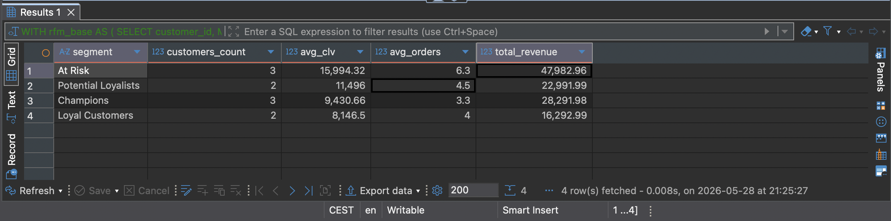

# techshop-analytics
Zadanie zaliczeniowe — SQL Analytics | Kurs Data Engineering

# TechShop Polska — Analytics Dashboard

Projekt analityczny dla fikcyjnego sklepu internetowego z elektroniką TechShop Polska.
Zawiera 5 zapytań SQL pokrywających kluczowe KPI sprzedażowe: wartość klienta (CLV),
trendy przychodów, analizę koszyka, produkty zagrożone spadkiem sprzedaży
oraz segmentację klientów metodą RFM.

---

## Instrukcja uruchomienia

1. Zainstaluj PostgreSQL oraz DBeaver
2. W DBeaver stwórz nową bazę danych: `CREATE DATABASE ecommerce;`
3. Połącz się z bazą `ecommerce` w DBeaver
4. Otwórz i uruchom plik `schema/01_ddl.sql` — tworzy tabele, indeksy, trigger i widok
5. Otwórz i uruchom plik `schema/02_seed_data.sql` — wstawia dane testowe
6. Otwórz dowolny plik z folderu `queries/` i uruchom zapytanie

---

## Opis zapytań

### 01_customer_clv.sql — Customer Lifetime Value
Top-10 klientów według łącznej wartości zamówień (CLV).
Mierzy: total_orders, CLV, avg_order_value, days_active, ranking RANK().

### 02_monthly_trend.sql — Miesięczny Trend Przychodów
Przychód per miesiąc z dynamiką wzrostu MoM i 3-miesięczną średnią kroczącą.
Mierzy: revenue, orders_count, unique_customers, mom_growth_pct, revenue_3m_avg.

### 03_basket_analysis.sql — Analiza Koszyka
Przychody i struktura koszyka per kategoria produktu.
Mierzy: avg_items_per_order, avg_order_value, revenue_share_pct, category_rank.

### 04_at_risk_products.sql — Produkty At Risk
Produkty ze spadkiem przychodu powyżej 30% kwartał do kwartału (QoQ).
Mierzy: decline_pct, rekomendacja URGENT (>50%) lub WARNING (30–50%).

### 05_rfm_segmentation.sql — Segmentacja RFM
Klasyfikacja klientów metodą RFM (Recency, Frequency, Monetary) na segmenty:
Champions, Loyal Customers, Potential Loyalists, At Risk, Lost.

---

## Zrzut ekranu — Segmentacja RFM (Część B)

